# Optimization Report: FastSearch (Go)
### Introduction

The FastSearch function is used to search and process user data from a JSON file. It reads information about users line by line, analyzes their list of browsers, and filters those that contain the substrings "Android" and "MSIE". Additionally, the function counts the number of unique browsers containing these substrings. 

**Benchmarks before an optimization**

`go test -bench=BenchmarkFast -benchmem`

```
goos: linux
goarch: amd64
pkg: hw3
cpu: 12th Gen Intel(R) Core(TM) i5-12600K
BenchmarkFast-16              63          18900629 ns/op        20450285 B/op     182867 allocs/op
PASS
ok      hw3     1.294s
Prime result:
BenchmarkSolution-8           500         2782432 ns/op         559910 B/op       10422 allocs/op
```

**CPU profile**

`GOGC=off go test -bench=BenchmarkFast -cpuprofile=profile/cpu.prof`  
`go tool pprof profile/cpu.prof`  
`top10`
```
(pprof) top10
Showing nodes accounting for 740ms, 62.71% of 1180ms total
Showing top 10 nodes out of 143
      flat  flat%   sum%        cum   cum%
     270ms 22.88% 22.88%      270ms 22.88%  runtime.memclrNoHeapPointers
      90ms  7.63% 30.51%      110ms  9.32%  encoding/json.checkValid
      70ms  5.93% 36.44%       70ms  5.93%  runtime.memmove
      60ms  5.08% 41.53%       60ms  5.08%  runtime.nextFreeFast (inline)
      50ms  4.24% 45.76%       50ms  4.24%  runtime.(*mspan).writeHeapBitsSmall
      50ms  4.24% 50.00%       50ms  4.24%  runtime.heapSetTypeSmallHeader (inline)
      40ms  3.39% 53.39%       40ms  3.39%  encoding/json.(*decodeState).rescanLiteral
      40ms  3.39% 56.78%      370ms 31.36%  regexp/syntax.(*compiler).inst
      40ms  3.39% 60.17%      440ms 37.29%  runtime.mallocgcSmallScanNoHeader
      30ms  2.54% 62.71%       30ms  2.54%  internal/runtime/syscall.Syscall6
```
`top10 -cum`
```
(pprof) top10 -cum
Showing nodes accounting for 0.08s, 6.78% of 1.18s total
Showing top 10 nodes out of 143
      flat  flat%   sum%        cum   cum%
     0.02s  1.69%  1.69%      1.17s 99.15%  hw3.FastSearch
         0     0%  1.69%      1.16s 98.31%  hw3.BenchmarkFast
         0     0%  1.69%      1.16s 98.31%  testing.(*B).runN
         0     0%  1.69%      1.15s 97.46%  testing.(*B).launch
         0     0%  1.69%      0.82s 69.49%  regexp.MatchString
         0     0%  1.69%      0.77s 65.25%  regexp.Compile (inline)
         0     0%  1.69%      0.77s 65.25%  regexp.compile
     0.01s  0.85%  2.54%      0.55s 46.61%  runtime.mallocgc
     0.01s  0.85%  3.39%      0.46s 38.98%  runtime.growslice
     0.04s  3.39%  6.78%      0.44s 37.29%  runtime.mallocgcSmallScanNoHeader
```
`peek hw3.FastSearch`
```
(pprof) peek hw3.FastSearch
Showing nodes accounting for 1.18s, 100% of 1.18s total
----------------------------------------------------------+-------------
      flat  flat%   sum%        cum   cum%   calls calls% + context
----------------------------------------------------------+-------------
                                             1.16s 99.15% |   hw3.BenchmarkFast
                                             0.01s  0.85% |   hw3.TestSearch
     0.02s  1.69%  1.69%      1.17s 99.15%                | hw3.FastSearch
                                             0.81s 69.23% |   regexp.MatchString
                                             0.23s 19.66% |   encoding/json.Unmarshal
                                             0.05s  4.27% |   io/ioutil.ReadAll (inline)
                                             0.02s  1.71% |   fmt.Sprintf
                                             0.01s  0.85% |   os.Open (inline)
                                             0.01s  0.85% |   runtime.concatstring2
                                             0.01s  0.85% |   runtime.mapaccess1_faststr
                                             0.01s  0.85% |   runtime.stringtoslicebyte
----------------------------------------------------------+-------------
```
`go tool pprof -http=localhost:8080 profile/cpu.prof`

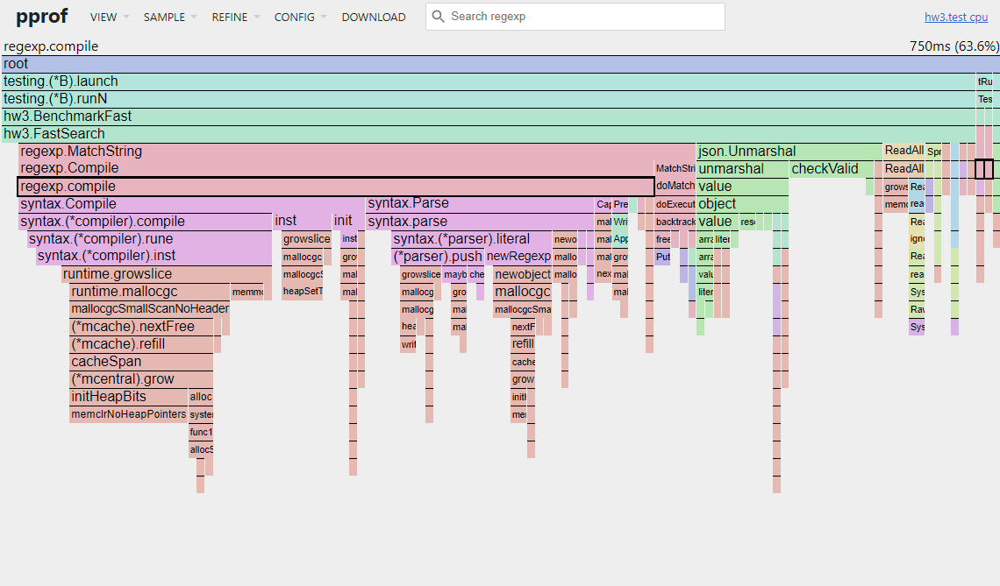

**Memory profile**

`GOGC=off go test -bench=BenchmarkFast -memprofile=profile/mem.prof`  
`go tool pprof profile/mem.prof`  
`top10`  
```
(pprof) top10
Showing nodes accounting for 1711.42MB, 94.28% of 1815.28MB total
Dropped 20 nodes (cum <= 9.08MB)
Showing top 10 nodes out of 43
      flat  flat%   sum%        cum   cum%
  690.26MB 38.03% 38.03%   690.26MB 38.03%  regexp/syntax.(*compiler).inst (inline)
  303.74MB 16.73% 54.76%   303.74MB 16.73%  io.ReadAll
  233.02MB 12.84% 67.59%   233.02MB 12.84%  regexp/syntax.(*parser).newRegexp (inline)
  141.86MB  7.81% 75.41%  1774.71MB 97.77%  hw3.FastSearch
  121.02MB  6.67% 82.08%  1241.82MB 68.41%  regexp.compile
  101.51MB  5.59% 87.67%   379.04MB 20.88%  regexp/syntax.parse
   38.50MB  2.12% 89.79%    38.50MB  2.12%  encoding/json.unquote (inline)
      34MB  1.87% 91.66%       72MB  3.97%  regexp/syntax.(*compiler).init (inline)
      26MB  1.43% 93.09%       26MB  1.43%  regexp/syntax.(*parser).maybeConcat
   21.51MB  1.18% 94.28%    21.51MB  1.18%  reflect.mapassign_faststr0
(pprof)
```
`top10 -cum`
```
(pprof) top10 -cum
Showing nodes accounting for 953.14MB, 52.51% of 1815.28MB total
Dropped 20 nodes (cum <= 9.08MB)
Showing top 10 nodes out of 43
      flat  flat%   sum%        cum   cum%
  141.86MB  7.81%  7.81%  1774.71MB 97.77%  hw3.FastSearch
         0     0%  7.81%  1732.61MB 95.45%  hw3.BenchmarkFast
         0     0%  7.81%  1732.61MB 95.45%  testing.(*B).runN
         0     0%  7.81%  1712.78MB 94.35%  testing.(*B).launch
         0     0%  7.81%  1241.82MB 68.41%  regexp.Compile (inline)
  121.02MB  6.67% 14.48%  1241.82MB 68.41%  regexp.compile
         0     0% 14.48%  1241.32MB 68.38%  regexp.MatchString
         0     0% 14.48%   724.26MB 39.90%  regexp/syntax.Compile
  690.26MB 38.03% 52.51%   690.26MB 38.03%  regexp/syntax.(*compiler).inst (inline)
         0     0% 52.51%   404.09MB 22.26%  regexp/syntax.(*compiler).compile
(pprof)
```
`peek hw3.FastSearch`
```
(pprof) peek hw3.FastSearch
Showing nodes accounting for 1815.28MB, 100% of 1815.28MB total
----------------------------------------------------------+-------------
      flat  flat%   sum%        cum   cum%   calls calls% + context
----------------------------------------------------------+-------------
                                         1732.61MB 97.63% |   hw3.BenchmarkFast
                                           21.15MB  1.19% |   hw3.init.0
                                           20.94MB  1.18% |   hw3.TestSearch
  141.86MB  7.81%  7.81%  1774.71MB 97.77%                | hw3.FastSearch
                                         1211.31MB 68.25% |   regexp.MatchString
                                             299MB 16.85% |   io/ioutil.ReadAll (inline)
                                          119.51MB  6.73% |   encoding/json.Unmarshal
                                            1.52MB 0.086% |   strings.Split (inline)
                                               1MB 0.056% |   regexp.(*Regexp).ReplaceAllString
                                            0.50MB 0.028% |   regexp.MustCompile
----------------------------------------------------------+-------------
```
`go tool pprof -http=localhost:8080 profile/mem.prof`

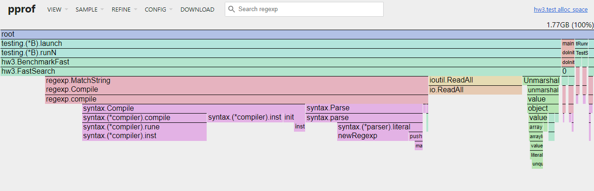

## Optimization

1)
```go
file, err := os.Open(filePath)
	if err != nil {
		panic(err)
	}
```
Missed the file closing

``` go
defer file.Close()
```
2)

```go
r := regexp.MustCompile("@") --> Delete
...
if ok, err := regexp.MatchString("Android", browser); ok && err == nil --> if strings.Contains(browser, "Android")
...
if ok, err := regexp.MatchString("MSIE", browser); ok && err == nil --> if strings.Contains(browser, "MSIE")
...
email := r.ReplaceAllString(user["email"].(string), " [at] ") --> email := strings.Replace(user["email"].(string), "@", " [at] ", 1)
```

**Intermediate result**

`go test -bench=BenchmarkFast -benchmem`

```
goos: linux
goarch: amd64
pkg: hw3
cpu: 12th Gen Intel(R) Core(TM) i5-12600K
BenchmarkFast-16             150           7611498 ns/op         6157465 B/op      46445 allocs/op
PASS
ok      hw3     2.010s
```

`GOGC=off go test -bench=BenchmarkFast -cpuprofile=profile/cpu.prof -memprofile=profile/mem.prof`  
`go tool pprof profile/cpu.prof`  
`top10 -cum`
```
(pprof) top10 -cum        
Showing nodes accounting for 0.16s, 14.95% of 1.07s total
Showing top 10 nodes out of 139
      flat  flat%   sum%        cum   cum%
         0     0%     0%      1.05s 98.13%  hw3.BenchmarkFast
     0.01s  0.93%  0.93%      1.05s 98.13%  hw3.FastSearch
         0     0%  0.93%      1.05s 98.13%  testing.(*B).launch
         0     0%  0.93%      1.05s 98.13%  testing.(*B).runN
         0     0%  0.93%      0.75s 70.09%  encoding/json.Unmarshal
         0     0%  0.93%      0.48s 44.86%  encoding/json.(*decodeState).unmarshal
     0.01s  0.93%  1.87%      0.47s 43.93%  encoding/json.(*decodeState).object
     0.01s  0.93%  2.80%      0.47s 43.93%  encoding/json.(*decodeState).value
     0.01s  0.93%  3.74%      0.26s 24.30%  runtime.mallocgc
     0.12s 11.21% 14.95%      0.24s 22.43%  encoding/json.checkValid
```
`peek hw3.FastSearch`
```
(pprof) peek hw3.FastSearch
Showing nodes accounting for 1.07s, 100% of 1.07s total
----------------------------------------------------------+-------------
      flat  flat%   sum%        cum   cum%   calls calls% + context
----------------------------------------------------------+-------------
                                             1.05s   100% |   hw3.BenchmarkFast
     0.01s  0.93%  0.93%      1.05s 98.13%                | hw3.FastSearch
                                             0.75s 71.43% |   encoding/json.Unmarshal
                                             0.16s 15.24% |   io/ioutil.ReadAll (inline)
                                             0.07s  6.67% |   strings.Contains (inline)
                                             0.04s  3.81% |   runtime.stringtoslicebyte
                                             0.01s  0.95% |   os.Open (inline)
                                             0.01s  0.95% |   runtime.makemap_small
----------------------------------------------------------+-------------
```
3)

Replace the map with struct User
```
type User struct {
	Browsers []string `json:"browsers"`
	Name     string   `json:"name"`
	Email    string   `json:"email"`
}
```
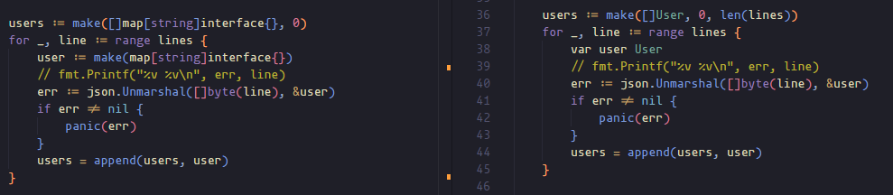

**Intermediate result**

```
goos: linux
goarch: amd64
pkg: hw3
cpu: 12th Gen Intel(R) Core(TM) i5-12600K
BenchmarkFast-16             168           6951461 ns/op         5569070 B/op      16518 allocs/op
PASS
ok      hw3     1.949s
```
 
 4)
```
seenBrowsers := []string{} --> seenBrowsers := make(map[string]bool, len(lines))
```
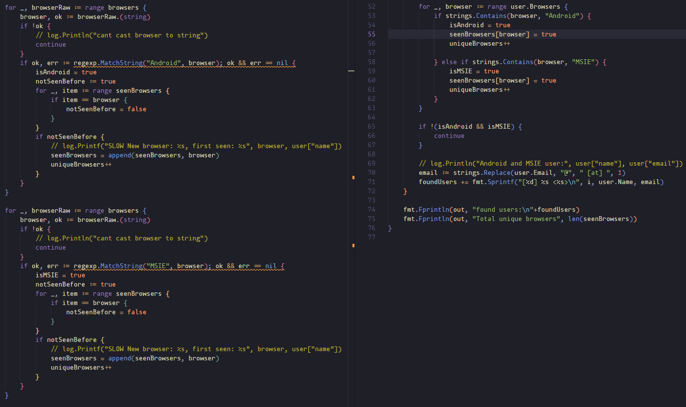

5)

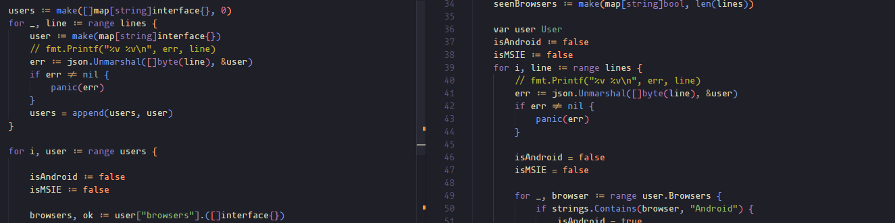

*Intermediate result**

```
goos: linux
goarch: amd64
pkg: hw3
cpu: 12th Gen Intel(R) Core(TM) i5-12600K
BenchmarkFast-16             171           6806992 ns/op         5386897 B/op      12520 allocs/op
PASS
ok      hw3     1.926s
```
`GOGC=off go test -bench=BenchmarkFast -cpuprofile=profile/cpu.prof -memprofile=profile/mem.prof`  
`go tool pprof profile/cpu.prof`  
`peek hw3.FastSearch`
```
(pprof) peek hw3.FastSearch
Showing nodes accounting for 960ms, 100% of 960ms total
----------------------------------------------------------+-------------
      flat  flat%   sum%        cum   cum%   calls calls% + context
----------------------------------------------------------+-------------
                                             920ms 98.92% |   hw3.BenchmarkFast
                                              10ms  1.08% |   hw3.TestSearch
         0     0%     0%      930ms 96.88%                | hw3.FastSearch
                                             600ms 64.52% |   encoding/json.Unmarshal
                                             200ms 21.51% |   io/ioutil.ReadAll (inline)
                                              60ms  6.45% |   strings.Contains (inline)
                                              40ms  4.30% |   runtime.stringtoslicebyte
                                              20ms  2.15% |   runtime.slicebytetostring
                                              10ms  1.08% |   os.Open (inline)
----------------------------------------------------------+-------------
```
`go tool pprof profile/mem.prof`
`peek hw3.FastSearch`
```
(pprof) peek hw3.FastSearch
Showing nodes accounting for 1415.96MB, 100% of 1415.96MB total
----------------------------------------------------------+-------------
      flat  flat%   sum%        cum   cum%   calls calls% + context
----------------------------------------------------------+-------------
                                         1363.09MB 99.34% |   hw3.BenchmarkFast
                                            4.67MB  0.34% |   hw3.init.0
                                            4.36MB  0.32% |   hw3.TestSearch
  353.96MB 25.00% 25.00%  1372.12MB 96.90%                | hw3.FastSearch
                                          827.06MB 60.28% |   io/ioutil.ReadAll (inline)
                                          183.02MB 13.34% |   encoding/json.Unmarshal
                                            5.59MB  0.41% |   strings.Split (inline)
                                            1.50MB  0.11% |   fmt.Sprintf
                                               1MB 0.073% |   strings.Replace
----------------------------------------------------------+-------------
```
6)
Replace the ReadAll with bufio.Scanner

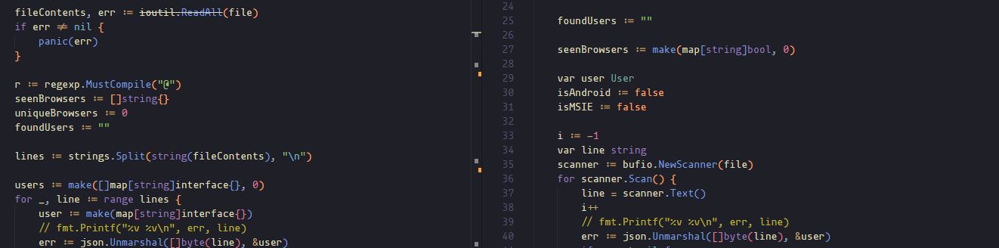

```
if err := scanner.Err(); err != nil {
		panic("scanner error: " + err.Error())
	}
```

**Intermediate result**
```
goos: linux
goarch: amd64
pkg: hw3
cpu: 12th Gen Intel(R) Core(TM) i5-12600K
BenchmarkFast-16              85          15152330 ns/op         2107083 B/op      13494 allocs/op
PASS
ok      hw3     2.338s
```

7)
To bytes

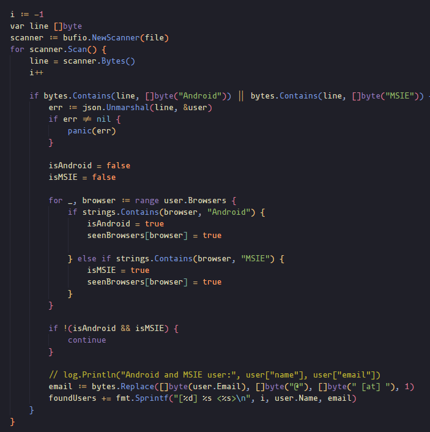

8)
Tear apart 'fmt.Fprintln(out, "found users:\n"+foundUsers)' and remove foundUsers

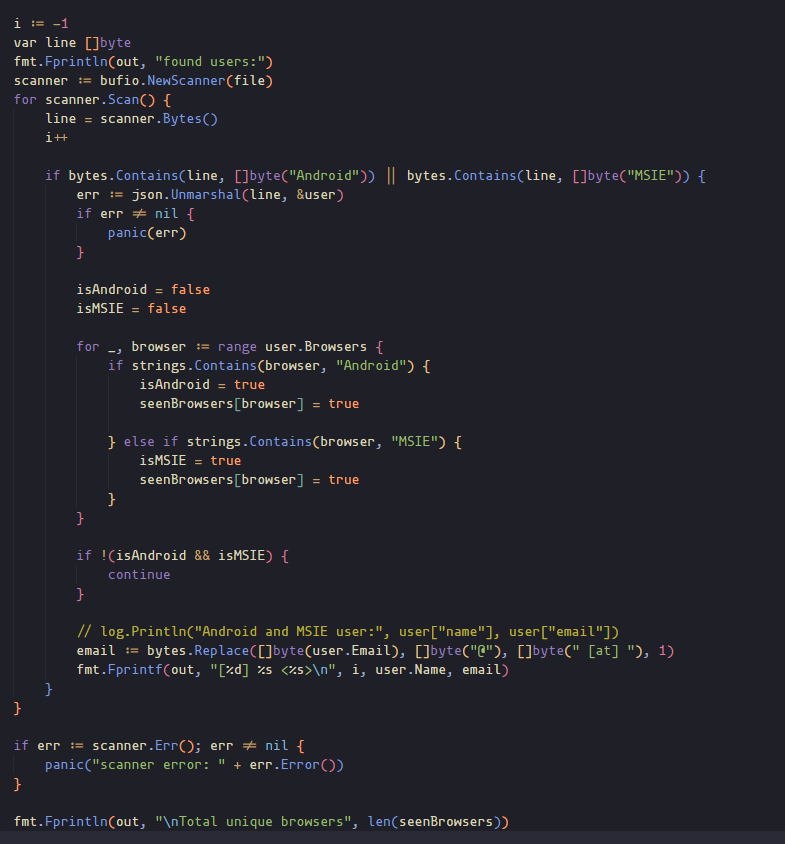

**Intermediate result**

```
goos: linux
goarch: amd64
pkg: hw3
cpu: 12th Gen Intel(R) Core(TM) i5-12600K
BenchmarkFast-16              97          12303263 ns/op          433516 B/op       6709 allocs/op
PASS
ok      hw3     2.023s
Prime result:
BenchmarkSolution-8           500         2782432 ns/op         559910 B/op       10422 allocs/op
```
### Completed!
### 433516 * 1.2 = 532219.2 < 559910
### 6709 * 1.2 = 8050.8.2 < 10422

9)
      The rest of the refactoring and easyjson
      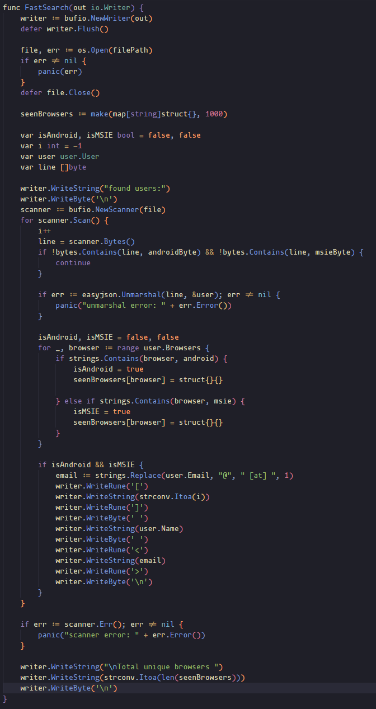

## Final result:

**Benchmarks after an optimization**

`go test -bench=BenchmarkFast -benchmem`

```
goos: linux
goarch: amd64
pkg: hw3
cpu: 12th Gen Intel(R) Core(TM) i5-12600K
BenchmarkFast-16             100          10096157 ns/op          339873 B/op       3643 allocs/op
PASS
ok      hw3     1.080s
Prime result:
BenchmarkSolution-8          500           2782432 ns/op          559910 B/op      10422 allocs/op
```

**CPU profile**

`GOGC=off go test -bench=BenchmarkFast -cpuprofile=profile/cpu.prof`  
`go tool pprof profile/cpu.prof`  
`top10`
```
(pprof) top10
Showing nodes accounting for 90ms, 100% of 90ms total
Showing top 10 nodes out of 48
      flat  flat%   sum%        cum   cum%
      20ms 22.22% 22.22%       20ms 22.22%  internal/runtime/syscall.Syscall6
      10ms 11.11% 33.33%       20ms 22.22%  bytes.IndexByte (inline)
      10ms 11.11% 44.44%       10ms 11.11%  github.com/mailru/easyjson/jlexer.(*Lexer).unsafeString
      10ms 11.11% 55.56%       10ms 11.11%  indexbytebody
      10ms 11.11% 66.67%       10ms 11.11%  memeqbody
      10ms 11.11% 77.78%       10ms 11.11%  runtime.futex
      10ms 11.11% 88.89%       10ms 11.11%  runtime.getMCache
      10ms 11.11%   100%       20ms 22.22%  runtime.mapassign_faststr
         0     0%   100%       30ms 33.33%  bufio.(*Scanner).Scan
         0     0%   100%       10ms 11.11%  bufio.ScanLines
```
`top10 -cum`
```
(pprof) top10 -cum
Showing nodes accounting for 10ms, 11.11% of 90ms total
Showing top 10 nodes out of 48
      flat  flat%   sum%        cum   cum%
         0     0%     0%       90ms   100%  testing.(*B).runN
         0     0%     0%       80ms 88.89%  hw3.BenchmarkFast
         0     0%     0%       80ms 88.89%  hw3.FastSearch
         0     0%     0%       80ms 88.89%  testing.(*B).launch
         0     0%     0%       30ms 33.33%  bufio.(*Scanner).Scan
         0     0%     0%       30ms 33.33%  github.com/mailru/easyjson.Unmarshal (inline)
         0     0%     0%       30ms 33.33%  hw3/user.(*User).UnmarshalEasyJSON (inline)
         0     0%     0%       30ms 33.33%  hw3/user.easyjsonC80ae7adDecodeHw3User
      10ms 11.11% 11.11%       20ms 22.22%  bytes.IndexByte (inline)
         0     0% 11.11%       20ms 22.22%  internal/poll.(*FD).Read
(pprof)
```
`peek hw3.FastSearch`
```
(pprof) peek hw3.FastSearch
Showing nodes accounting for 90ms, 100% of 90ms total
----------------------------------------------------------+-------------
      flat  flat%   sum%        cum   cum%   calls calls% + context
----------------------------------------------------------+-------------
                                              80ms   100% |   hw3.BenchmarkFast
         0     0%     0%       80ms 88.89%                | hw3.FastSearch
                                              30ms 37.50% |   bufio.(*Scanner).Scan
                                              30ms 37.50% |   github.com/mailru/easyjson.Unmarshal (inline)
                                              20ms 25.00% |   runtime.mapassign_faststr
----------------------------------------------------------+-------------
```
`go tool pprof -http=localhost:8080 profile/cpu.prof`

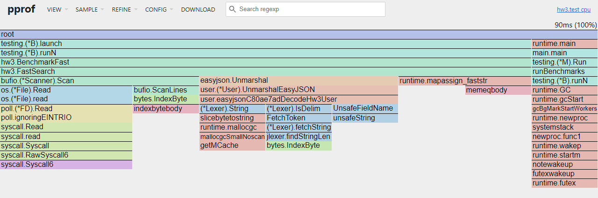

**Memory profile**

`GOGC=off go test -bench=BenchmarkFast -memprofile=profile/mem.prof`  
`go tool pprof profile/mem.prof`  
`top10`  
```
(pprof) top10
Showing nodes accounting for 62.88MB, 94.02% of 66.88MB total
Showing top 10 nodes out of 61
      flat  flat%   sum%        cum   cum%
      24MB 35.89% 35.89%       24MB 35.89%  github.com/mailru/easyjson/jlexer.(*Lexer).String
   16.01MB 23.93% 59.82%    16.01MB 23.93%  regexp/syntax.(*compiler).inst (inline)
    7.65MB 11.45% 71.27%     7.65MB 11.45%  io.ReadAll
    4.15MB  6.20% 77.47%    37.81MB 56.53%  hw3.SlowSearch
       3MB  4.49% 81.95%        3MB  4.49%  regexp/syntax.(*parser).newRegexp (inline)
    2.57MB  3.84% 85.79%    27.57MB 41.22%  hw3.FastSearch
       2MB  2.99% 88.78%    24.01MB 35.90%  regexp.compile
       2MB  2.99% 91.77%        6MB  8.97%  regexp/syntax.parse
       1MB  1.50% 93.27%        1MB  1.50%  encoding/json.(*decodeState).literalStore
    0.50MB  0.75% 94.02%     0.50MB  0.75%  bufio.NewWriterSize (inline)
```
`top10 -cum`
```
(pprof) top10 -cum
Showing nodes accounting for 32.72MB, 48.92% of 66.88MB total
Showing top 10 nodes out of 61
      flat  flat%   sum%        cum   cum%
    4.15MB  6.20%  6.20%    37.81MB 56.53%  hw3.SlowSearch
    2.57MB  3.84% 10.04%    27.57MB 41.22%  hw3.FastSearch
         0     0% 10.04%    27.57MB 41.22%  testing.(*B).runN
         0     0% 10.04%    27.07MB 40.47%  hw3.BenchmarkFast
         0     0% 10.04%    27.07MB 40.47%  testing.(*B).launch
         0     0% 10.04%    24.01MB 35.90%  regexp.Compile (inline)
         0     0% 10.04%    24.01MB 35.90%  regexp.MatchString
       2MB  2.99% 13.03%    24.01MB 35.90%  regexp.compile
         0     0% 13.03%       24MB 35.89%  github.com/mailru/easyjson.Unmarshal (inline)
      24MB 35.89% 48.92%       24MB 35.89%  github.com/mailru/easyjson/jlexer.(*Lexer).String
```
`peek hw3.FastSearch`
```
(pprof) peek hw3.FastSearch
Showing nodes accounting for 66.88MB, 100% of 66.88MB total
----------------------------------------------------------+-------------
      flat  flat%   sum%        cum   cum%   calls calls% + context
----------------------------------------------------------+-------------
                                           27.07MB 98.19% |   hw3.BenchmarkFast
                                            0.50MB  1.81% |   hw3.init.0
    2.57MB  3.84%  3.84%    27.57MB 41.22%                | hw3.FastSearch
                                              24MB 87.06% |   github.com/mailru/easyjson.Unmarshal (inline)
                                            0.50MB  1.82% |   bufio.NewWriter (inline)
                                            0.50MB  1.81% |   strings.Replace
----------------------------------------------------------+-------------
```
`go tool pprof -http=localhost:8080 profile/mem.prof`

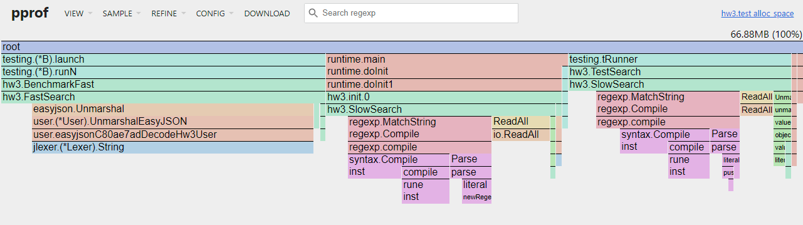